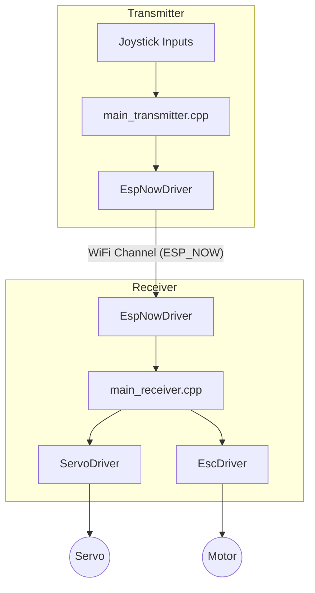

```markdown
# RC Car Wireless Control System



## Project Overview
This project implements a high-performance, bidirectional wireless control system for an RC car using the ESP32 platform. The system utilizes the **ESP-NOW** protocol for low-latency, peer-to-peer communication, enabling real-time control of steering and speed while simultaneously streaming telemetry data (battery voltage and motor RPM) back to the transmitter.

## Project Scope
* **Transmitter (Remote Controller):** Reads dual-joystick analog inputs, manages local user interface, and broadcasts control packets.
* **Receiver (RC Car):** Interprets control packets, manages ESC (Electronic Speed Controller) for propulsion, controls steering servos, and sends real-time telemetry back to the controller.
* **Communication:** Low-latency bidirectional data exchange using dedicated Wi-Fi channels.
* **Safety Features:** Includes deadzone mapping, incremental speed ramping to prevent motor stall/damage, and watchdog-style telemetry feedback.

## Architecture
The system is designed as a modular, event-driven C++ application compatible with PlatformIO.

* **Communication Layer:** Uses `EspNowDriver` to handle handshake, pairing, and bidirectional data transmission.
* **Hardware Abstraction Layer (HAL):** Segregated drivers for ESC, Servo, and Input Controls, ensuring the main application logic remains decoupled from hardware pinout.
* **Configuration Management:** Centralized `Config.h` file for calibration constants, pin mapping, and network parameters.

## Dependencies
This project relies on the following libraries and frameworks:

| Dependency | Purpose |
| :--- | :--- |
| **Arduino Framework** | Core platform functionality |
| **ESP32 Arduino Core** | ESP32-specific hardware abstraction |
| **ESP32Servo** | PWM control for Servos and ESCs |

# Local Project Setup Guide (VS Code + PlatformIO)

This guide provides the steps to set up your RC Car project environment in Visual Studio Code.

## 1. Initial Setup
1. **Install VS Code:** Download and install [Visual Studio Code](https://code.visualstudio.com/).
2. **Install PlatformIO Extension:**
   * Open VS Code.
   * Go to the **Extensions** view (click the square icon in the sidebar).
   * Search for **PlatformIO IDE** and click **Install**. 
   * Wait for the installation to finish and restart VS Code if prompted.
   * You might also need to install official C++ extension from Microsoft

## 2. Project Initialization
1. Open the **PlatformIO** icon (the Alien head) in the left sidebar.
2. Click **PIO Home** -> **New Project**.
   * **Name:** `RC-Car-Control`
   * **Board:** `Espressif ESP32 Dev Module`
   * **Framework:** `Arduino`
   * **Location:** Choose your local project directory.