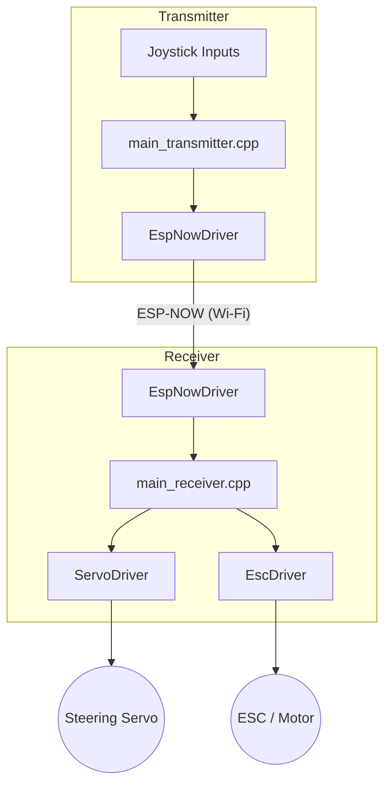
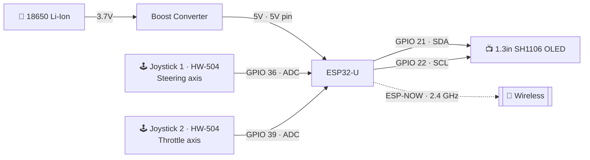
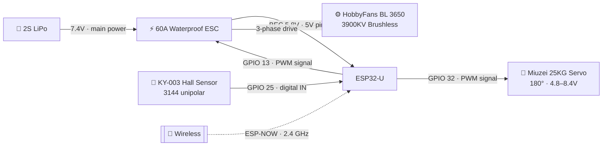
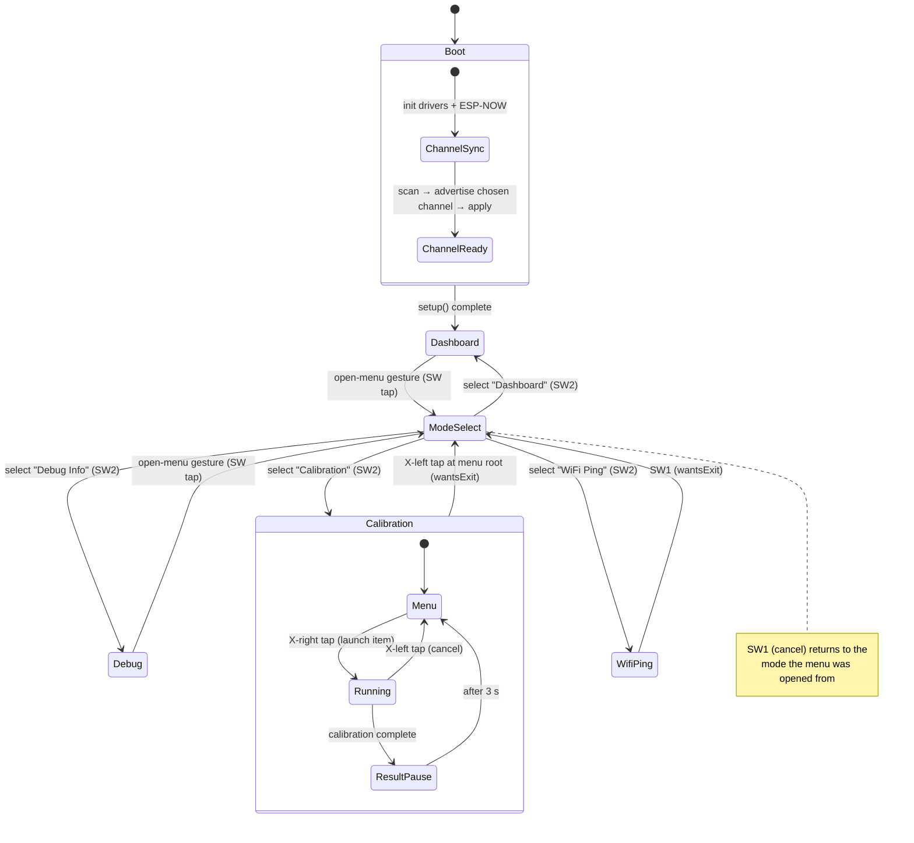
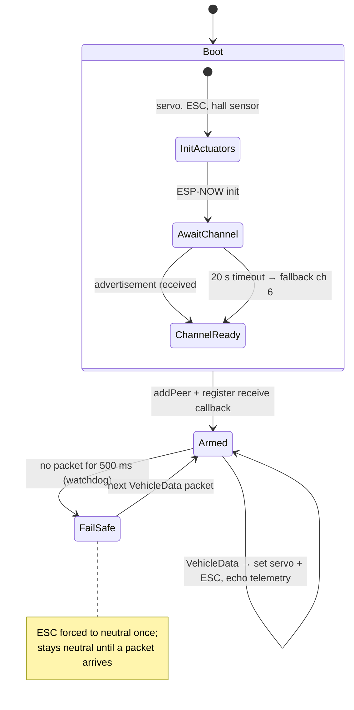

# RC Car Wireless Control System

Bidirectional wireless RC car controller using two ESP32 boards and the ESP-NOW protocol. One board acts as the handheld transmitter (joystick remote), the other as the receiver mounted on the car.



---

## Components

### Transmitter (remote)

| Component | Part | Notes |
|-----------|------|-------|
| Microcontroller | ESP32-U (ESP32 Dev Module) | Wi-Fi / ESP-NOW |
| Joystick × 2 | HW-504 dual-axis module | X axis → GPIO 36, Y axis → GPIO 39 |
| Display | 1.3" SH1106 OLED | I2C — SDA GPIO 21, SCL GPIO 22 |
| Battery | 18650 Li-Ion cell | ~3.7 V nominal |
| Power regulation | Step-up boost converter | 5 V output → ESP32 5 V pin |

> During development the transmitter can be powered directly over USB-C.

### Receiver (car)

| Component | Part | Notes |
|-----------|------|-------|
| Microcontroller | ESP32-U (ESP32 Dev Module) | Wi-Fi / ESP-NOW |
| Servo | Miuzei 25KG Digital Servo | 180°, 4.8–8.4 V DC — GPIO 32 |
| ESC | Waterproof 60A 2S LiPo BEC | 5.8 V / 3 A BEC output — GPIO 13 |
| Motor | HobbyFans BL 3650-3900KV | 4-pole brushless, driven by ESC |
| Hall sensor | KY-003 (3144 unipolar) module | RPM telemetry — GPIO 25 |
| Battery | 2S LiPo | Powers ESC; BEC supplies 5.8 V to ESP32 and servo |

---

## Hardware

### Transmitter pinout



| Pin | Signal | Direction | Connected to |
|-----|--------|-----------|--------------|
| GPIO 36 | ADC input | IN | Joystick 1 — steering (X axis) |
| GPIO 39 | ADC input | IN | Joystick 2 — throttle (Y axis) |
| GPIO 21 | I2C SDA | OUT | SH1106 OLED |
| GPIO 22 | I2C SCL | OUT | SH1106 OLED |
| 5V | Power | IN | Boost converter output |
| GND | Ground | — | Common ground |

---

### Receiver pinout



| Pin | Signal | Direction | Connected to |
|-----|--------|-----------|--------------|
| GPIO 13 | PWM 1–2 ms | OUT | ESC throttle signal |
| GPIO 32 | PWM 0.5–2.5 ms | OUT | Steering servo |
| GPIO 25 | Digital IN (active-low) | IN | Hall sensor signal (S pin) |
| 3.3 V | Power | OUT | Hall sensor VCC |
| 5V | Power | IN | ESC BEC output (5.8 V) |
| GND | Ground | — | Common ground |

---

## Project Structure

```
src/
├── main_transmitter.cpp          # Transmitter entry point
├── main_receiver.cpp             # Receiver entry point
├── config/
│   ├── ControlConfig.h           # Joystick calibration, servo/ESC tuning
│   ├── DebugConfig.h             # Per-subsystem debug flags
│   ├── Esp32Pins.h               # GPIO pin assignments
│   └── WifiConfig.h              # MAC addresses, ESP-NOW config
└── drivers/
    ├── controls/                 # Joystick ADC sampling (averaging)
    ├── debug/                    # Serial + screen logging
    ├── esc/
    │   ├── EscDriver             # ESC PWM output
    │   ├── EscLogic.h            # Pure speed computation (testable, no Arduino dep)
    │   └── EscCalibration        # Throttle-range calibration sequence
    ├── screen/
    │   ├── Screen / ScreenDriver # Display abstraction
    │   ├── protocols/sh1106/     # SH1106 OLED driver
    │   └── calibration/          # On-screen calibration UI screens
    │       ├── CalibrationFlow   # Top-level scrollable menu orchestrator
    │       ├── EscRangeCalibScreen    # Throttle endpoint learning
    │       ├── EscMotorCalibScreen    # Motor direction detect + signal-wire fix
    │       ├── EscSetupScreen         # Reset all 17 ESC rows to factory defaults
    │       ├── EscParamScreen         # Interactive editor for ESC rows 1-12
    │       ├── LowVoltageCalibScreen  # LV cutoff cell/voltage/protection (rows 12-14)
    │       ├── JoystickCalibScreen    # Joystick axis endpoints
    │       ├── ServoCalibScreen       # Steering servo centre trim
    │       └── ThrDeadzoneCalibScreen # Throttle neutral dead-band
    ├── servo/
    │   ├── ServoDriver           # Servo PWM output with smoothing
    │   └── ServoLogic.h          # Pure angle computation (testable, no Arduino dep)
    └── wifi/
        ├── EspNowDriver          # ESP-NOW init, peer management, send/receive
        └── DataTypes.h           # VehicleData / TelemetryData structs

test/
├── test_esc_logic/               # Unit tests — ESC speed mapping
└── test_servo_logic/             # Unit tests — servo angle mapping
```

---

## Architecture

### Driver pattern
Each hardware subsystem lives in its own directory under `src/drivers/`. Headers expose only the public API (`init*`, `update*`, `set*`); all internal state is `static` within the `.cpp`.

### Testable logic headers
Pure computation (mapping, deadzone, clamping) is separated into header-only files (`EscLogic.h`, `ServoLogic.h`) that have no Arduino or hardware dependencies. These are included by the driver `.cpp` files and tested natively without any mocking.

### Safety behaviours
- **Input deadzone** — small joystick deflections near center are ignored to suppress drift.
- **Servo smoothing** — `updateServo()` steps toward the target by at most `SERVO_SMOOTHING_STEP_MICROS` per cycle, preventing steering snap.
- **Packet-loss watchdog** — the receiver resets the ESC to neutral if no ESP-NOW packet arrives within 500 ms.

---

## Firmware State Machines

### Transmitter

`main_transmitter.cpp` owns a top-level mode machine (`TransmitterOperatingMode`). After a boot
sequence that negotiates the Wi-Fi channel with the receiver, it starts in **Dashboard**.
**Mode Select** is the hub: any mode opens it with the menu gesture, and it either launches the
chosen mode (SW2) or cancels back to the mode it was opened from (SW1). **Calibration** is itself
a nested flow.



### Receiver

`main_receiver.cpp` is headless. It initialises the actuators, listens for the transmitter's
channel advertisement (falling back to channel 6 after a 20 s timeout), then runs a two-state
runtime: **Armed** while packets flow, dropping to **Fail-Safe** (ESC forced to neutral) if no
`VehicleData` packet arrives within the 500 ms watchdog window. The next valid packet re-arms it.



---

## Hall Sensor (RPM telemetry)

Motor RPM is measured on the receiver by a **KY-003 / 3144 unipolar Hall effect sensor** and sent back to the transmitter as part of the `TelemetryData` packet. The transmitter dashboard displays RPM live.

### Wiring

The sensor is rated **4.5 V – 24 V minimum**. Power it from the 5 V rail, not 3.3 V — below 4.5 V the output is unstable and produces false pulses. Because the signal pin pulls to ~5 V when no magnet is detected, a simple voltage divider is required to protect the ESP32's 3.3 V GPIO.

```
                          5V (BEC)
                            │
                          [VCC]──── sensor
                          [GND]──── GND
                          [ S ]──┬──── 10 kΩ ──── GPIO 25
                                 │
                               20 kΩ
                                 │
                                GND

5 V × 20 kΩ / (10 kΩ + 20 kΩ) = 3.33 V  →  safe for ESP32
```

The module has a built-in pull-up to VCC and an indicator LED. The output is **active-low** (HIGH ≈ 5 V when no magnet, LOW ≈ 0 V when magnet detected).

### Sensor orientation

The **3144 is a unipolar sensor** — it only responds to the **south pole** of a magnet. If the indicator LED does not light up when you bring a magnet close, flip the magnet over.

### Placement and `HALL_PULSES_PER_REV`

| Placement | `HALL_PULSES_PER_REV` | Notes |
|-----------|----------------------|-------|
| Near motor rotor (testing) | `2` | 4-pole motor has 2 south-pole faces per revolution |
| Reduction gear with 1 magnet | `1` | Single magnet glued to gear or wheel |
| Gear with N magnets | `N` | Space magnets evenly for accurate reading |

Set `HALL_PULSES_PER_REV` in `src/config/ControlConfig.h`.

### Noise filtering

The ESC and brushless motor generate significant switching noise. The driver applies two layers of filtering to prevent false RPM readings:

- **ISR debounce** (`HALL_MIN_PULSE_INTERVAL_US`, default 1000 µs) — pulses arriving faster than 1 ms apart are discarded in the interrupt handler. This corresponds to > 30 000 RPM and is physically impossible for this motor, so all faster signals are noise.
- **Minimum pulse threshold** (`HALL_MIN_PULSES_FOR_RPM`, default 3) — fewer than 3 pulses per 150 ms window reports 0 RPM, eliminating stray pulses that survive the debounce.

If false readings persist at idle, add a **100 nF ceramic capacitor** between the signal wire and GND directly at the sensor header pins.

---

## ESC Programming

When `CALIBRATION_MODE = true` in `src/config/ControlConfig.h`, the transmitter boots into an on-screen calibration menu instead of normal driving. The menu includes several ESC tools that program the ESC directly via its throttle signal wire — no programming card required.

### How signal-wire programming works

The ESC enters its built-in programming mode when it sees full throttle on power-up, followed by full brake. Once in programming mode, the ESC steps through its 17 parameter rows one at a time:

- **Advance** to the next option in a row: brief full-throttle pulse (~500 ms)
- **Confirm** the current option and advance to the next row: long full-brake pulse (~1500 ms)
- **Save and exit**: hold full throttle for ~3 s

All calibration screens output these pulses automatically via ESP-NOW to the receiver. The user only interacts with the transmitter joystick and OLED.

### Calibration menu

Navigate with the transmitter joystick: **Y-tap** up/down scrolls, **X-right tap** launches, **X-left tap** returns to menu.

| Menu item | What it does |
|-----------|-------------|
| **ESC Range** | Learns the full throttle range (min/max pulse widths) by recording stick endpoints |
| **ESC Motor Dir** | Sends a test pulse; if the car reverses, offers to fix via signal-wire programming (row 2) or via the `THROTTLE_INVERT` software flag |
| **ESC Defaults** | Programs all 17 rows to position 1 (factory defaults) in one automated pass (~45 s). Run **Motor Dir** and **Low Voltage** calibrations again afterwards |
| **ESC Tuning** | Interactive editor for rows 1–12 (see table below). Row 13–17 (LV protection, throttle stroke, sync rect) are left unchanged on the ESC |
| **Joystick Axis** | Records raw min/centre/max for each joystick axis |
| **Servo Alignment** | Adjusts the steering servo centre trim |
| **Low Voltage** | Selects battery cell count, per-cell cutoff voltage, and protection type, then programs rows 12–14 |
| **Throttle Feel** | Live tuner for throttle response — drive the motor with the throttle stick while the steering stick adjusts deadzone / expo / rate; SW1 cycles the parameter, hold SW1 to save. Prints `THROTTLE_EXPO` / `THROTTLE_RATE` / `JOY_DEADZONE_Y` |
| **Steering Feel** | Same live tuner for steering — drive the servo with the steering stick while the throttle stick adjusts deadzone / expo / rate. Prints `STEERING_EXPO` / `STEERING_RATE` / `JOY_DEADZONE_X` |

### ESC Tuning — parameter reference

The **ESC Tuning** screen lets you set each of the 12 parameters individually. Y-up/dn taps cycle the value; X-right tap advances to the next parameter. After all 12 are set, confirm to start the programming sequence.

| Row | Parameter | Options | Default (pos 1) |
|-----|-----------|---------|-----------------|
| 1 | Operation model | Fwd+BndBrk / Fwd+Rev+Inv / Fwd+PropBrk / Fwd+Rev+Prop | Fwd+BndBrk |
| 2 | Motor direction | Normal / Reversed | Normal |
| 3 | Start mode (throttle response) | L1 (softest) … L10 (sharpest) | L1 |
| 4 | Min forward strength | 5% / 7% / 9% / 12% / 14% / 16% / 18% / 20% / 22% / 25% | 5% |
| 5 | Min backing strength | 6% / 7% / 8% / 12% / 14% / 16% / 18% / 20% / 92% / 100% | 6% |
| 6 | Max backing strength | 23% / 32% / 40% / 49% / 58% / 66% / 75% / 83% | 23% |
| 7 | Initial braking (drag brake) | 0% / 5% / 11% / 16% / 22% / 27% / 33% / 38% / 44% / 50% | 0% |
| 8 | Max braking strength | 0% / 11% / 22% / 33% / 44% / 55% / 66% / 77% / 88% / 100% | 0% |
| 9 | Braking force | 0% / 11% / 22% / 33% / 44% / 55% / 66% / 77% / 88% / 100% | 0% |
| 10 | Neutral point range | 2% / 2.3% / 2.6% / 3.0% / 3.3% / 3.6% / 4.0% / 4.3% | 2% |
| 11 | Brake frequency | 16 KHz / 8 KHz / 4 KHz / 2 KHz / 500 Hz / 250 Hz / 125 Hz | 16 KHz |
| 12 | Li battery cells | Auto / 2S / 3S / 4S / 5S / 6S | Auto |

> Option positions are sourced from the ESC datasheet. Verify against your specific ESC manual before programming.

### Motor direction — software alternative

If you don't want to use signal-wire programming to fix a reversed motor, set the compile-time flag in `src/config/ControlConfig.h`:

```cpp
#define THROTTLE_INVERT true   // mirrors ESC output around neutral (1100+1900-x)
```

This has zero runtime cost and preserves the correct neutral point.

### Safety notes

- **Low Voltage protection (rows 13–14) is never touched by ESC Tuning.** If you need to change LV settings, use the dedicated **Low Voltage** calibration.
- **ESC Defaults resets rows 13–14 to position 1** (`No protection` / `2.6 V`). Always run **Low Voltage** calibration immediately after running ESC Defaults.
- After any signal-wire programming session, power-cycle the ESC before driving.

---

## Setup

### Requirements
- [PlatformIO Core](https://docs.platformio.org/en/latest/core/installation/) (CLI or VS Code extension)
- `make`

### Install PlatformIO CLI
```sh
pip install platformio
# or via the VS Code PlatformIO extension
```

### Clone and configure
```sh
git clone <repo-url>
cd esp32-rc-car-project
```

Edit `src/config/WifiConfig.h` and set the MAC addresses of your two boards. To find them, flash either board and read the MAC printed on boot via `make monitor-tx` / `make monitor-rx`.

---

## Usage

All common tasks are wrapped in a `Makefile`. Run `make help` to see all targets.

### Build

```sh
make build-tx    # compile transmitter firmware
make build-rx    # compile receiver firmware
```

### Flash

With **one device** connected, port is auto-detected:
```sh
make upload-tx
make upload-rx
```

With **both devices** connected simultaneously:
```sh
make ports                                      # list USB serial ports
make set-tx PORT=/dev/cu.usbserial-4            # save transmitter port
make set-rx PORT=/dev/cu.usbserial-0001         # save receiver port

make upload-tx          # uses saved port from now on
make upload-rx
```

Port assignments are stored in `.ports` (gitignored). One-off overrides still work:
```sh
make upload-tx PORT=/dev/cu.usbserial-other
```

### Monitor serial output

```sh
make monitor-tx
make monitor-rx
```

---

## Testing

Unit tests run natively on the host (no hardware required):

```sh
make test
```

```
native:test_esc_logic    PASSED  (12 tests)
native:test_servo_logic  PASSED  (13 tests)
25 test cases: 25 succeeded
```

Tests cover endpoint values, deadzone boundaries (inclusive/exclusive), input clamping, known mapped values, output range invariants, and servo monotonicity.

To add a test suite, create `test/test_<name>/test_<name>.cpp` and follow the existing examples. Pure computation logic should go in a `*Logic.h` header; hardware-coupled code in the driver `.cpp` cannot be tested natively without mocking.

---

## Configuration

All tunable constants live in `src/config/ControlConfig.h`:

| Constant | Default | Description |
|----------|---------|-------------|
| `JOY_DEADZONE` | `75` | ADC units of joystick drift to ignore |
| `JOYSTICK_X_MIN/MAX` | `100 / 3950` | Calibrated joystick X endpoints |
| `SERVO_MIN/NEUTRAL/MAX_MICROS` | `500 / 1500 / 2500` | Servo PWM range |
| `SERVO_CENTER_TRIM_MICROS` | `80` | Center offset to straighten wheels |
| `SERVO_SMOOTHING_STEP_MICROS` | `150` | Max servo step per loop cycle |
| `CALIBRATION_MODE` | `true` | Boot into on-screen calibration menu |

ESC PWM constants (`ESC_MIN/NEUTRAL/MAX_MICROS`) are defined in `src/drivers/esc/EscLogic.h`.

---

## Dependencies

| Library | Used by | Purpose |
|---------|---------|---------|
| `madhephaestus/ESP32Servo` | transmitter + receiver | PWM for servo and ESC |
| `olikraus/U8g2` | transmitter | OLED display driver |
| Unity (auto-installed) | native tests | C unit test framework |
