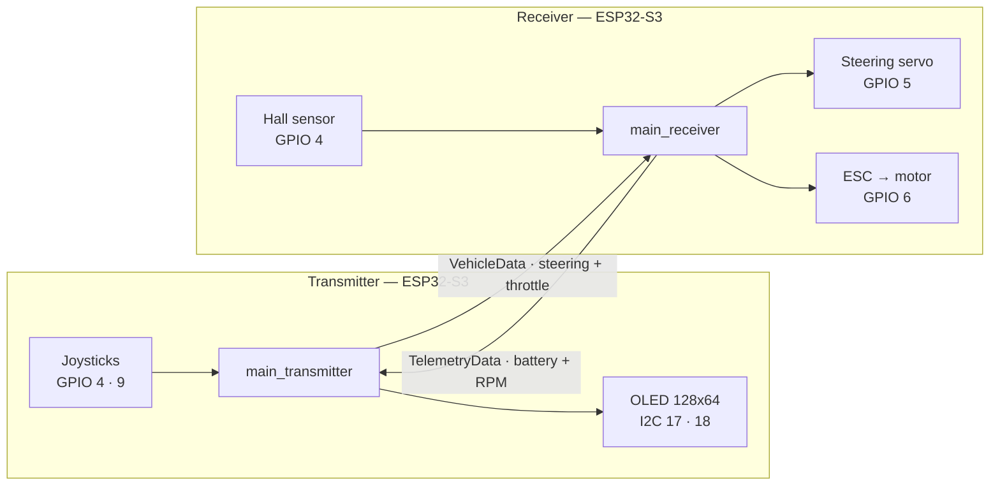

# RC Car Wireless Control System

Bidirectional RC car control over ESP-NOW, built from one source tree into two firmwares: a handheld **transmitter** (twin joysticks + OLED) and a **receiver** on the car (steering servo, ESC, hall speed sensor). Both boards are ESP32-S3-DevKitC-1.



## Features

- **Automatic channel selection** — scans the 2.4 GHz band at boot, picks the least congested channel, and advertises it so the car follows without being reflashed.
- **Long Range mode** — switches ESP-NOW to the LR PHY through a runtime handshake, reverting to Standard on its own if the link goes quiet.
- **Failsafe arming** — the ESC holds neutral and the steering centres when commands stop; propulsion stays gated until the throttle is seen back at neutral.
- **Live telemetry** — pack voltage and motor RPM echo back each frame; the dashboard shows speed, link latency, packet loss and jitter.
- **On-screen calibration** — joystick axes, servo alignment, and throttle/steering feel (expo and rate), with no rebuild.
- **Session tracking** — distance, elapsed time, top and average speed, plus a speed-over-time graph.

## Hardware

Analog inputs must stay on **ADC1 (GPIO 1–10)** — ADC2 is unusable while Wi-Fi is active. Pin maps live in `src/config/controller/`.

### Transmitter

| GPIO | Signal | Connected to |
|---|---|---|
| 4 / 5 | ADC in · button | Left stick — throttle axis + click (exit/back) |
| 9 / 10 | ADC in · button | Right stick — steering axis + click (enter/select) |
| 15 | Digital in | DEBUG mode switch, other leg to GND |
| 1 | ADC in | Battery sense, through a divider |
| 17 / 18 | I2C SDA · SCL | 128x64 OLED — pick the controller in `ScreenDriverConfig.h` |
| 38 | WS2812 | Status LED |

### Receiver

| GPIO | Signal | Connected to |
|---|---|---|
| 5 | PWM out | Steering servo |
| 6 | PWM out | ESC throttle |
| 4 | Digital in | Hall speed sensor — see [docs/hall-sensor.md](docs/hall-sensor.md) |
| 1 | ADC in | Battery sense, through a divider |
| 48 | WS2812 | Status LED |

Power the servo and ESC from the pack or the ESC's BEC, never from the ESP32's 3V3 rail, and tie every ground together — a servo-lead ground is the signal's only voltage reference.

## Quick start

Needs [PlatformIO Core](https://docs.platformio.org/en/latest/core/installation/index.html) (`pip install platformio`) or the VS Code extension.

```sh
make help                              # every target
make test                              # 125 native unit tests, no hardware needed
make build-tx                          # static-check, then compile
make set-tx PORT=/dev/cu.usbmodem...   # save the board's port once, into .ports
make upload-tx                         # flash
make monitor-tx                        # serial at 115200
```

The same targets end in `-rx` for the receiver, and `make ports` lists connected devices. Every build and upload runs `pio check` first and refuses to proceed on a medium- or high-severity defect.

## Layout

`src/` is organised by altitude rather than by board: `drivers/` touches peripherals, `comm/` carries ESP-NOW messaging, `ui/` draws screens, `app/` holds top-level modes, and `config/` keeps tuning separate from pin maps. Which board compiles what is decided solely by `build_src_filter` in `platformio.ini`. [CLAUDE.md](CLAUDE.md) documents the conventions in full.

Pure computation lives in `*Logic.h` headers with no Arduino dependency — that is what makes it testable on the host, and `test/` holds one Unity suite per logic header.

## Configuration

One file per subsystem under `src/config/`: `JoystickConfig.h` (stick centres, deadzones, expo/rate), `ServoConfig.h` (steering travel limit and centre trim), `EscConfig.h`, `HallConfig.h`, `VehicleConfig.h` (wheel and gearing, for km/h), `BatteryConfig.h`, `DebugConfig.h`, `WifiConfig.h` — **set the two MAC addresses there to your own boards before first flash** — and `ScreenDriverConfig.h`, where `ACTIVE_SCREEN_PROTOCOL` selects the OLED controller (SSD1306, SSD1309 or SH1106) at compile time. The panels look identical but need different U8g2 init sequences, so the wrong choice leaves the screen blank; only the I2C address (0x3C/0x3D) and whether a panel is present are detected at runtime, and the transmitter boots headless if none answers.

Both firmwares compile the same config, so a change to a shared constant means reflashing *both* boards. Prefer the on-screen **Calibration** mode over editing stick values by hand: it prints paste-ready `#define`s to serial under the `[JOY CAL]` tag.

## Dependencies

| Library | Purpose |
|---|---|
| `madhephaestus/ESP32Servo` | Servo and ESC PWM generation |
| `olikraus/U8g2` | OLED rendering |
| Unity (bundled with PlatformIO) | Native unit tests |
